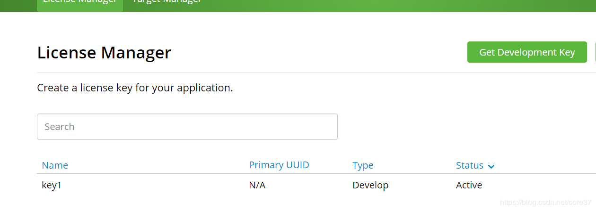
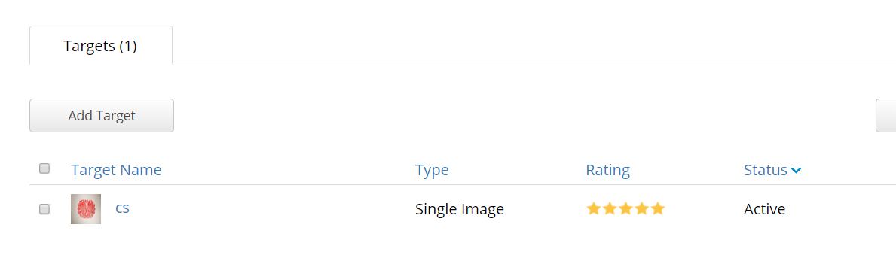
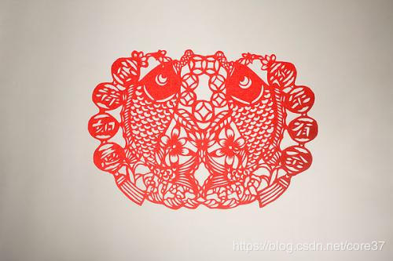
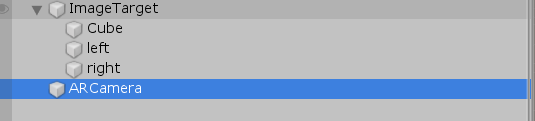
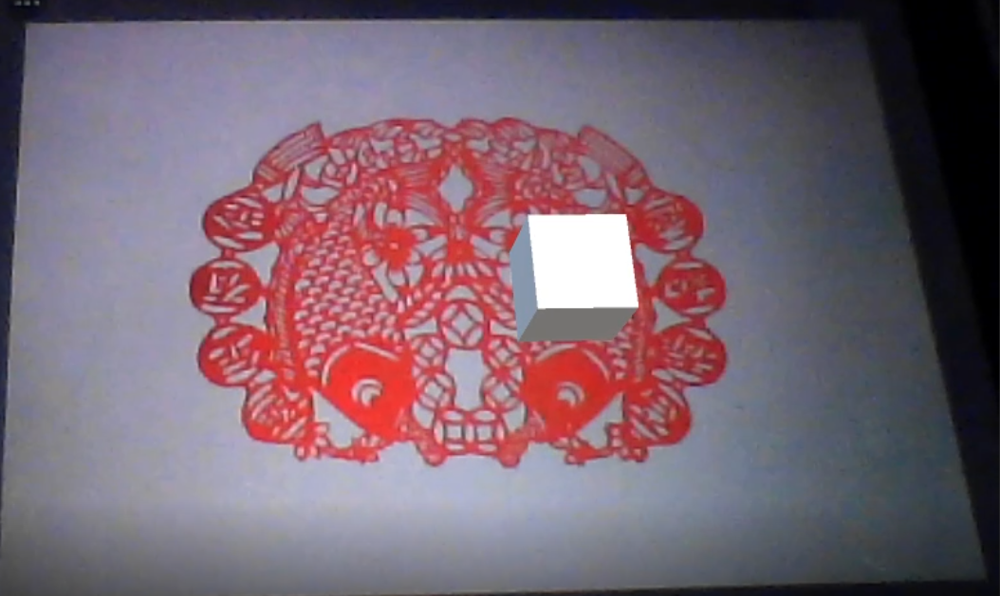
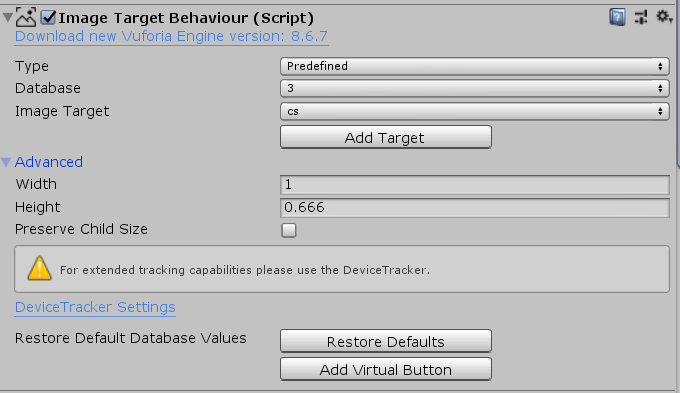
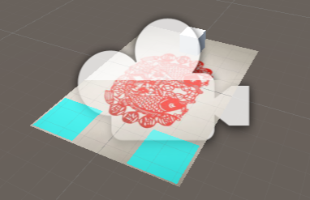
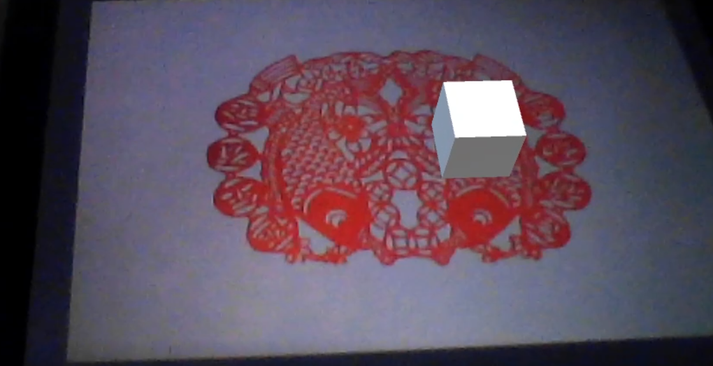
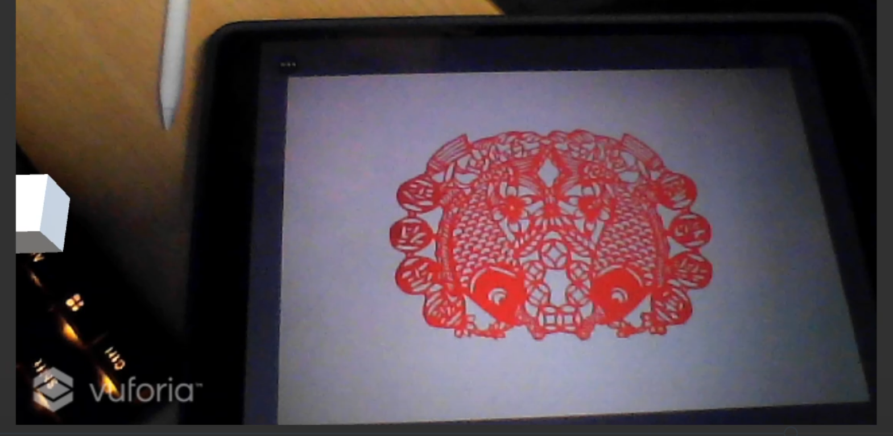

# report

## 图像识别与建模

1. 首先到vuforia官网进行注册，创建KEY和DATABASE





这里采用上传一张窗花照片作为图像识别的模板


下载对应的数据库，导入到本地


3. 按照官网说明下载对应的update script，然后导入插件，启用vuforia。


完成后即应该有对应的选项可供创建

3. 创建ARcemera和image object，设置对应的数据库

   然后加入自身设计的Unity3D模型，这里采用Cube作为模型

   

   

4. 运行即可有如下效果

   

## 添加虚拟按键



从imagetarget中选择添加虚拟按键



对按键的位置进行配置调整


编写imagetarget的script,即可添加点击事件。

```
using System.Collections;
using System.Collections.Generic;
using UnityEngine;
using Vuforia;

public class t1 : MonoBehaviour, IVirtualButtonEventHandler
{
    public GameObject cube;
    public VirtualButtonBehaviour[] VRbehaviours;

    void Start()
    {
        VRbehaviours = GetComponentsInChildren<VirtualButtonBehaviour>();
        VRbehaviours[1].RegisterEventHandler(this);
        VRbehaviours[0].RegisterEventHandler(this);

        cube = GameObject.Find("Cube");
    }

    void Update()
    {

    }

    void IVirtualButtonEventHandler.OnButtonPressed(VirtualButtonBehaviour vb)
    {
        Debug.Log("catch");
        cube.transform.position += new Vector3(-0.1f, 0, 0);

    }

    void IVirtualButtonEventHandler.OnButtonReleased(VirtualButtonBehaviour vb)
    {

    }
}
```






进行点击之后，即可实现移动。