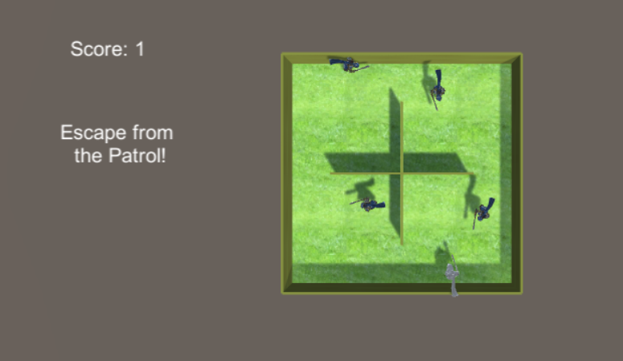

# 智能巡逻兵

游戏设计要求：
* 创建一个地图和若干巡逻兵(使用动画)；
* 每个巡逻兵走一个3~5个边的凸多边型，位置数据是相对地址。即每次确定下一个目标位置，用自己当前位置为原点计算；
* 巡逻兵碰撞到障碍物，则会自动选下一个点为目标；
* 巡逻兵在设定范围内感知到玩家，会自动追击玩家
* 失去玩家目标后，继续巡逻；
* 计分：玩家每次甩掉一个巡逻兵计一分，与巡逻兵碰撞游戏结束；

程序设计要求：

必须使用订阅与发布模式传消息
    subject：OnLostGoal
    Publisher: ?
    Subscriber: ?

## 设计过程

设计模式参考之前的博客，大致如下

 

订阅与发布模式：
通过gameStatusOp类完成，这个类提供：
* score方法，调用一次加一分；其他类的事件通过订阅这个函数完成游戏的计分，巡逻兵类的checkNearByHero订阅此函数，每次玩家离开巡逻范围都能够增加分数。
* gameover方法：巡逻兵类的OnCollisionStay订阅此函数，每次玩家碰撞巡逻兵之后即可宣告结束。


### 设计效果如下：




### 按键控制

使用detectKeyInput()和Input.GetKey()函数进行控制，传递移动信息。
```
void detectKeyInput() {
        if (Input.GetKey(KeyCode.UpArrow)) {
            action.heroMove(Diretion.UP);
        }
        if (Input.GetKey(KeyCode.DownArrow)) {
            action.heroMove(Diretion.DOWN);
        }
        if (Input.GetKey(KeyCode.LeftArrow)) {
            action.heroMove(Diretion.LEFT);
        }
        if (Input.GetKey(KeyCode.RightArrow)) {
            action.heroMove(Diretion.RIGHT);
        }
    }
```

### 巡逻兵工厂

生成4个相同的巡逻兵，很适合使用工厂模式进行。

```
public class PatrolFactory : System.Object {
        private static PatrolFactory instance;
        private GameObject PatrolItem;

        private Vector3[] PatrolPosSet = new Vector3[] {
            new Vector3(-5f, 0.2f, -5f),
            new Vector3(-5f, 0.2f, 5f),
            new Vector3(5f, 0.2f, -5f),
            new Vector3(5f, 0.2f, 5f)};

        public static PatrolFactory getInstance() {
            if (instance == null)
                instance = new PatrolFactory();
            return instance;
        }

        public void initItem(GameObject _PatrolItem) {
            PatrolItem = _PatrolItem;
        }

        public GameObject getPatrol() {
            GameObject newPatrol = Camera.Instantiate(PatrolItem);
            return newPatrol;
        }

        public Vector3[] getPosSet() {
            return PatrolPosSet;
        }
    }
```

### 玩家的移动

通过一个函数，使得整个物体的朝向和位置发生改变即可

```
public void heroMove(int dir) {
        myHero.transform.rotation = Quaternion.Euler(new Vector3(0, dir * 90, 0));
        switch (dir) {
            case Diretion.UP:
                myHero.transform.position += new Vector3(0, 0, 0.1f);
                break;
            case Diretion.DOWN:
                myHero.transform.position += new Vector3(0, 0, -0.1f);
                break;
            case Diretion.LEFT:
                myHero.transform.position += new Vector3(-0.1f, 0, 0);
                break;
            case Diretion.RIGHT:
                myHero.transform.position += new Vector3(0.1f, 0, 0);
                break;
        }
    } 
```


### 巡逻兵的移动
首先考虑随机移动，通过随机函数计算其朝向和移动距离，传递信息给action模块，给巡逻兵添加移动。对于抓捕移动，则可以直接朝向主人公，并且不断的更新位置，即可实现抓捕效果。

````
int getRandomDirection(int index, bool isActive) {
        return PatrolLastDir[index] == 2 ? -1 : PatrolLastDir[index] + 1;
    }
    //判定巡逻兵走出了自己的区域
    bool PatrolOutOfArea(int index, int randomDir) {
        Vector3 patrolPos = PatrolSet[index].transform.position;
        float posX = patrolPos.x;
        float posZ = patrolPos.z;
        switch (index) {
            case 0:
                if (randomDir == 1 && posX + 2 > 0
                    || randomDir == 0 && posZ + 2 > 0)
                    return true;
                break;
            case 1:
                if (randomDir == 1 && posX + 2 > 0
                    || randomDir == 2 && posZ - 2 < 0)
                    return true;
                break;
            case 2:
                if (randomDir == -1 && posX - 2 < 0
                    || randomDir == 0 && posZ + 2 > 0)
                    return true;
                break;
            case 3:
                if (randomDir == 1 && posX + 2 > 0
                    || randomDir == 0 && posZ + 2 > 0)
                    return true;
                break;
        }
        return false;
    }

    //追捕hero
    public void addDirectMovement(GameObject sourceObj) {
        int index = getIndexOfObj(sourceObj);
        PatrolLastDir[index] = -2;

        sourceObj.transform.LookAt(myHero.transform);
        Vector3 oriTarget = myHero.transform.position - sourceObj.transform.position;
        Vector3 target = new Vector3(oriTarget.x / 4.0f, 0, oriTarget.z / 4.0f);
        target += sourceObj.transform.position;
        //Debug.Log("addDirectMovement: " + target);
        addSingleMoving(sourceObj, target, PERSON_SPEED_CATCHING, true);
    }
```
