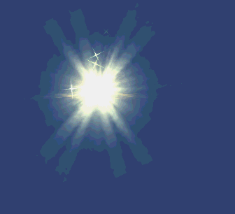
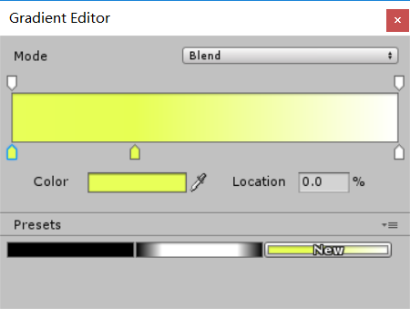
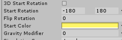
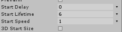
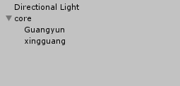
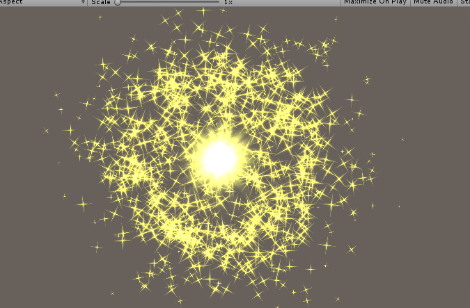

# Homework8实验报告

## 实验要求

简单粒子制作

- 按参考资源要求，制作一个粒子系统，[参考资源](http://www.cnblogs.com/CaomaoUnity3d/p/5983730.html)
- 使用 3.3 节介绍，用代码控制使之在不同场景下效果不一样


## 实验过程

### 基础部分

  

实现一个带光晕的魔法球


1. 首先创建一个粒子对象，选取GameObject->Effect->Particle System创建
2. 下载对应的资源
3. 分解为核心、光晕、星光


#### 核心

魔法球的核心是一些不会移动的粒子，故讲粒子的speed设置为0，shape设置为Sphere，调整其色彩，这里应用到了color over lifetime




#### 光晕

光晕的创建类似于核心，不过需要采用不同的贴图，修改半径，将光晕的发散角度设置为-180~180



#### 星光

星光的创建则需要修改其大小和贴图，并将speed设置为合适值。



#### 完成结构如下




### Script部分

类似3.3创建一个星光的script

```c#
using System.Collections;
using System.Collections.Generic;
using UnityEngine;

public class partscript : MonoBehaviour {

    public float Revs;
    public float exhaustRate;

    ParticleSystem exhaust;


    void Start () {
        exhaust = GetComponent<ParticleSystem>();
    }


    void Update () {
        exhaust.emissionRate = Revs * exhaustRate;
        Revs = Revs+1;
    }
}

```

这里使得emissionRate递增上升，配合Loop展现出一种波纹效果

效果如下




