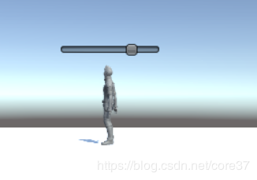
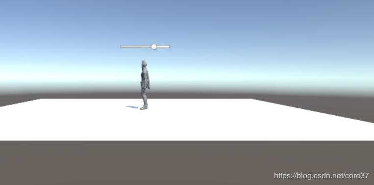

#  血条（Health Bar）的预制设计
### 具体要求如下
* 分别使用 IMGUI 和 UGUI 实现
* 使用 UGUI，血条是游戏对象的一个子元素，任何时候需要面对主摄像机
* 分析两种实现的优缺点
* 给出预制的使用方法
#### 分析两种实现的优缺点
##### IMGUI
IMGUI（Immediate Mode GUI）及时模式图形界面。它是代码驱动的 UI 系统，没有图形化设计界面，只能在 OnGUI 阶段用 GUI 系列的类绘制各种 UI 元素，因此 UI元素只能浮在游戏界面之上。

IMGUI 的存在符合游戏编程的传统，即使在今天它依然没有被官方宣判为遗留系统（Legacy Systems）。在修改模型，渲染模型这样的经典游戏循环编程模式中，在渲染阶段之后，绘制 UI 界面无可挑剔。这样的编程即避免了 UI 元素保持在屏幕最前端，又有最佳的执行效率，一切控制掌握在程序员手中。

按 Unity 官方说法，IMGUI 主要用于以下场景：

- 在游戏中创建调试显示工具
- 为脚本组件创建自定义的 Inspector 面板。
- 创建新的编辑器窗口和工具来扩展 Unity 环境。

IMGUI系统通常不打算用于玩家可能使用并与之交互的普通游戏内用户界面。为此，应该使用 Unity 的基于 GameObject 的 UGUI 系统。

###### 优势
- 代码主导，能够有效控制
- 扩展性强
- 能够快速创建简单工具
- 执行效率高

###### 劣势
- 需要一定的代码基础
- 开发效率低，难以调试

#####  UGUI

###### 优势：

- 所见即所得（WYSIWYG）设计工具
- 支持多模式、多摄像机渲染
- 面向对象的编程

###### 劣势：

- 对于简单操作而言工作量大
- 扩展性低
- 调试困难，不易修改
- 难以和设计模式结合

### IMGUI实现

```
using System.Collections;
using System.Collections.Generic;
using UnityEngine;
using UnityEngine.UI;

public class IMGUI : MonoBehaviour {
	private float hSliderValue = 75f;
    private void OnGUI()
    {
        Vector3 worldPos = new Vector3(transform.position.x, transform.position.y, transform.position.z);
        Vector2 screenPos = Camera.main.WorldToScreenPoint(worldPos);
        hSliderValue = GUI.HorizontalSlider (new Rect(screenPos.x -50,screenPos.y,100,100), hSliderValue, 0.0f, 100.0f);
    }
}

```

实现效果如下


### UGUI实现
- 菜单 Assets -> Import Package -> Characters 导入资源
- 在层次视图，Context 菜单 -> 3D Object -> Plane 添加 Plane 对象
- 资源视图展开 Standard Assets :: Charactors :: ThirdPersonCharater :: Prefab
- 将 ThirdPersonController 预制拖放放入场景，改名为 Ethan
- 设置属性
	-  Plane 的 Transform 的 Position = (0,0,0)
	- Ethan 的 Transform 的 Position = (0,0,0)
	- Main Camera 的 Transform 的 Position = (0,1,-10)
- 选择 Ethan 用上下文菜单 -> UI -> Canvas, 添加画布子对象
- 选择 Ethan 的 Canvas，用上下文菜单 -> UI -> Slider 添加滑条作为血条子对象
- 选择 Ethan 的 Canvas，在 Inspector 视图
- 设置 Canvas 组件 Render Mode 为 World Space
- 设置 Rect Transform 组件 (PosX，PosY，Width， Height) 为 (0,2,160,20)
- 设置 Rect Transform 组件 Scale （x,y） 为 (0.01,0.01)

效果如下
